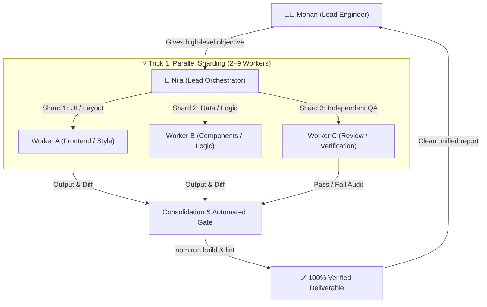

# Multi-Agent Orchestration & Task Sharding Guide
**A Practical Blueprint for High-Velocity Autonomous AI Collaboration**

---

## 1. Vision & Architecture

In modern AI-assisted software engineering, single-agent execution often hits a bottleneck: asking one agent to analyze, refactor, and review dozens of files serially takes unnecessary time. 

This guide establishes the **Parallel Task Sharding (Trick 1) Protocol** pioneered by **Mohan (Lead Engineer)** and **Nila (Lead AI Orchestrator & Autonomous Architect)** for `parvath-new` and future projects.

---

## 2. Core Roles & Interaction Model

| Role | Entity | Responsibilities |
|---|---|---|
| **Lead Engineer / Developer** | **Mohan** | Sets high-level objectives, features, and business requirements. Does not micromanage subagent creation. |
| **Lead AI Orchestrator & Architect** | **Nila** | Deconstructs Mohan's tasks, designs the architecture, spawns parallel worker agents, resolves dependencies, and conducts the final consolidation. |
| **Autonomous Background Workers** | **Subagents (Workers A..N)** | Specialized instances dispatched dynamically with targeted prompts to execute isolated tasks in parallel. |

---

## 3. The "Trick 1" Sharding Strategy

### Why Single-Agent Is Slow:
* Reading 20+ files serially: ~1.5 mins
* Editing 20+ files serially: ~2 mins
* Auditing & running builds: ~1.5 mins
* **Total Time**: ~5+ minutes.

### How Parallel Sharding Solves This:
Instead of 1 worker doing 20 tasks serially, Nila splits the payload into parallel streams:
* **Worker A**: Audits files 1–10.
* **Worker B**: Audits files 11–20.
* **Worker C**: Runs test build & lint checks concurrently.
* **Result**: Execution finishes in the time of a single shard (~45–60 seconds).

---

## 4. Execution Workflow (Step-by-Step)

### Step 1: Rapid Task Decomposition
When Mohan requests a change (e.g., *"Make sections spacious across all pages"*):
1. Nila identifies the core root cause (e.g., design tokens in `src/index.css` and individual component paddings).
2. Divides the workload into distinct, non-overlapping domains:
   - **Domain 1**: CSS foundation & global token definition.
   - **Domain 2**: Section container updates (CTA, Stats, BrandTicker, Footer).
   - **Domain 3**: Internal grid margins & component layouts.
   - **Domain 4**: Independent QA & Verification.

### Step 2: Concurrent Worker Dispatch
Nila invokes parallel workers in a single tool call:
* Concurrency limit: **Keep concurrent active subagents between 2 and 9** to maximize throughput while avoiding rate-limits or system throttling.
* Workspace isolation: Workers operate on clean workspaces (`inherit`, `branch`, or `share`).

### Step 3: Zero-Polling Reactive Wait
* Nila does **not** poll or sleep in loops.
* Antigravity’s event bus automatically wakes Nila up when subagents deliver their final reports.

### Step 4: Automated Verification Gate (Strict Mandate)
Before anything is reported to Mohan, all worker changes must pass:
1. `npm run build` (Ensures 0 syntax errors, valid module imports, and zero broken CSS/JSX).
2. `npm run lint` (Checks against code standards via `oxlint`).
3. Viewport audit (Specific verification of mobile screens down to 390px with zero horizontal scroll).

### Step 5: Clean Delivery to Mohan
Nila delivers a concise, actionable summary with clickable links to all modified files, outlining exactly what changed and inviting Mohan to preview the results.

---

## 5. Real-World Sharding Patterns

### Pattern A: Multi-File Style / Layout Overhaul
* **Worker 1**: Global tokens & CSS layers (`src/index.css`).
* **Worker 2**: Home & Landing components (`Hero.jsx`, `Stats.jsx`, `CTA.jsx`, `Footer.jsx`).
* **Worker 3**: Sub-pages (`About.jsx`, `Services.jsx`, `Contact.jsx`, `Insights.jsx`).
* **Worker 4**: Independent QA Reviewer (Runs `npm run build` and tests 390px responsiveness).

### Pattern B: Feature Addition (e.g. New Calculator)
* **Worker 1 (Math & Logic)**: Writes financial formula in `src/lib/finance.js` and creates data schema.
* **Worker 2 (UI Component)**: Builds the interactive slider and input fields.
* **Worker 3 (Results & Charts)**: Builds breakdown visualizers and summary badges.
* **Worker 4 (Reviewer)**: Validates calculation accuracy with edge cases.

### Pattern C: Performance & Accessibility Audit
* **Worker 1**: Audits color contrast & keyboard navigation (`:focus-visible`).
* **Worker 2**: Audits image optimization (`avif`/`webp`, `loading="lazy"`).
* **Worker 3**: Audits bundle sizes and dynamic imports.

---

## 6. Golden Rules for Developers & Agents

1. **Quality is Non-Negotiable**: Speed must never degrade UI elegance, typographic hierarchy, or functional stability.
2. **Preserve Codebase Integrity**: Never overwrite unrelated comments, types, or existing working logic.
3. **Keep Worker Instructions Specific**: Assign each worker one concrete objective with strict output constraints (e.g., *"Audit files X, Y, Z for 390px overflow and return PASS/FAIL"*).
4. **Never Leave Broken Builds**: If any worker introduces an error, Nila immediately intercepts and corrects it before reporting to Mohan.

---

*Authored by Nila & Mohan — Parvath Engineering Team*
